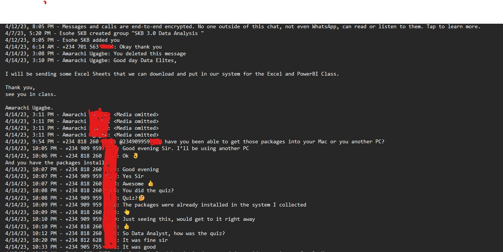
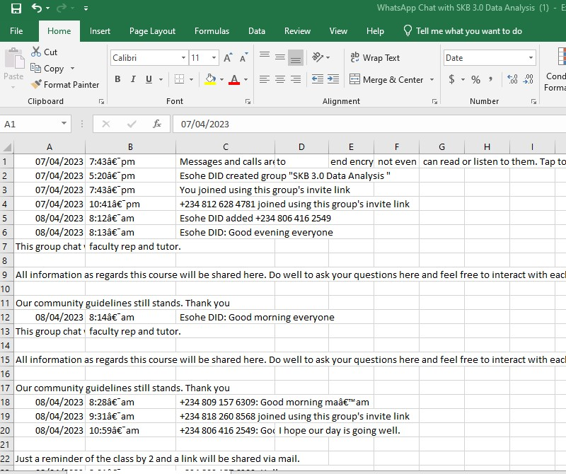
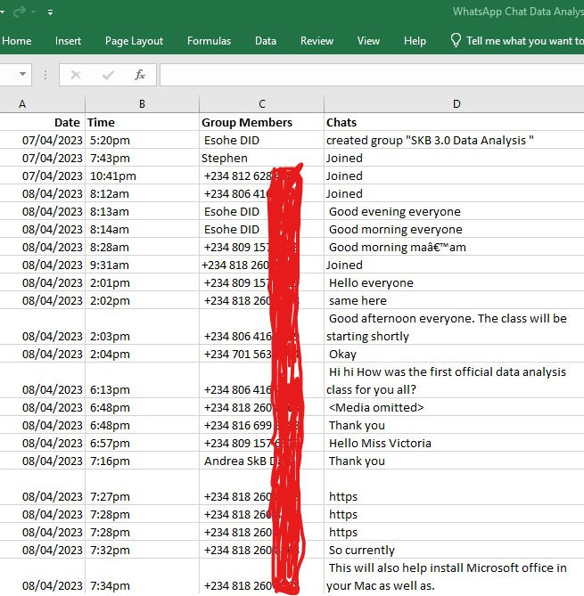
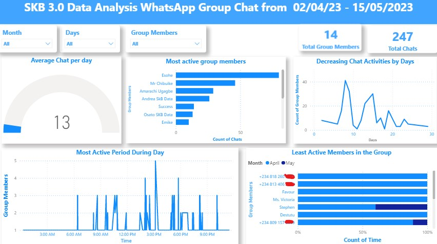

# SKB 3.0-Group-WhatsApp-Data-Analysis

## Introduction
This is a power Bi project on WhatsApp chat analysis of a group chat called SKB 3.0 Data Analysis group. The project is to show ability to work with text files, analyze and derive insights from the group. 

# Problem statement
1. Who are the most active mebers of the group
2. Show the least active members of the group?
3. Which time of the day is the group most active?
4. Is chatting increasing or decreasing overtime.

# Skills/Concepts Demostrated
1. Data Cleaning
2. Data transformation
3. Visualization
4. Report

## Data Transformation/Cleaning 

Raw data in text file
  Raw data imported into excel 

## Cleaned Data in Excel

The following steps were taken to clean the file after been imported to excel:

1. Headers where create to form a new title 
2. The date and time columns was clean with special character in the time column cleaned using find and replace in excel.
3. The chats where put into a single columns
4. Empty columns where deleted
5. The date columns was separated into day, month and year.

# Data Visualizations

# Data Analysis

1. From the dashboard total chats in the group between 2/04/23 - 15/05/2023 is 247 with a total group members of 14
2. The dashboard, when observed shows that Esohe, Mr Chibuike and Amarachi are the most active people in the group follow closely by Andrea and Success.
3. Also in the dashboard, it reveal that +234818260, +234813406, favour, Ms. Victoria.... are the least most active members of the group.
4. The most active period of the group chat as revealed by the dashboard is usually between 2pm - 6pm in the day.
5. The dashboard also shows a decreasing number of chats by the group members, group members are becoming less active in the group chats.

# Limitations
 1. From the data there is no way to identify who a message was responding to except the person was directly tagged.
 2.  The data transformation and report does not provide data on who a message was in response to.

End
